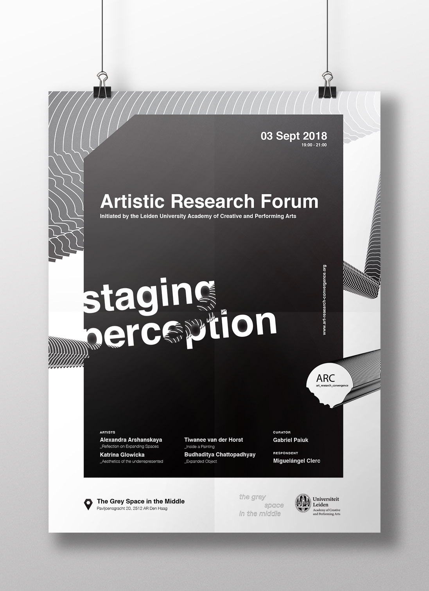

Performance and presentation of art research project

On Monday September 3 at 19:00, I will be presenting my art research project about spatial perception and perform live Drawing ‘Reflection on Expanding Spaces’ during the second [ARC (art\_research\_convergence) forum](http://www.art-research-convergence.org/) which will take place at [The Grey Space in the Middle](http://thegreyspace.net/#events_button) in The Hague (Paviljoensgracht 20). Besides the performance there will be on display the [CUBUS Installation](https://arshanskaya.com/cubus-installation/) and oil painting the [‘Vanishing point’](https://arshanskaya.com/paintings/).

ARC is a new platform for the artistic-academic discourse in the Netherlands and is an initiative of the [Leiden University Academy of Creative and Performing Arts (ACPA)](https://www.universiteitleiden.nl/en/humanities/academy-of-creative-and-performing-arts/acpa-outreach).  
‘Reflection on Expanding Spaces’ is ongoing project by visual artist Alexandra Arhanskaya and musician Sharon Stewart.

[Event in Facebook](https://www.facebook.com/events/867065160347618/)

