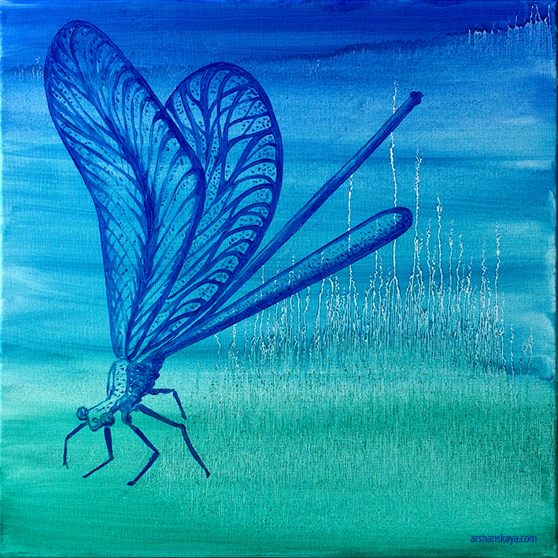
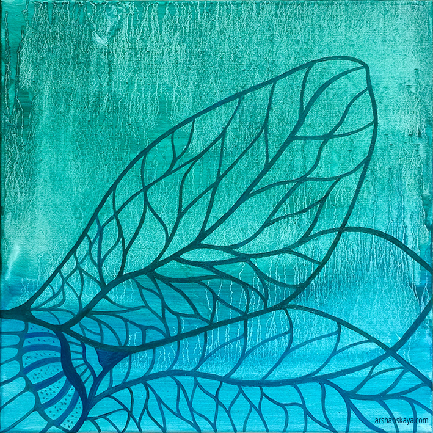

These two brand new paintings, another two paintings and 33 prints (etchings and dry needle) will be exposed at the Asser Institute (R.J. Schimmelpennincklaan 20-22, 2517 JN, The Hague) from October 16th.

Welcome to the opening event with lectures, discussions and performances on **Wednesday October 16th at 17.15**.

At **19.15** I’ll be performing **digital live drawing** alongside with a harp music by [Daniëlle Uriël](http://www.danielleuriel.nl/). Welcome!

In this event, lawyers, artists, musicians and architects explore the relationship between art and international justice from different angles: sounds, design and visuals. You are invite for an (ex)change of perspectives and open a dialogue about the mutual interests of these different disciplines.

Please, find full program, more information about the event and register [here](https://www.asser.nl/education-events/events/?id=3091)

   
Dragonfly. Oil on canvas, 50x50cm. Fly. Oil on canvas, 50×50 cm.
