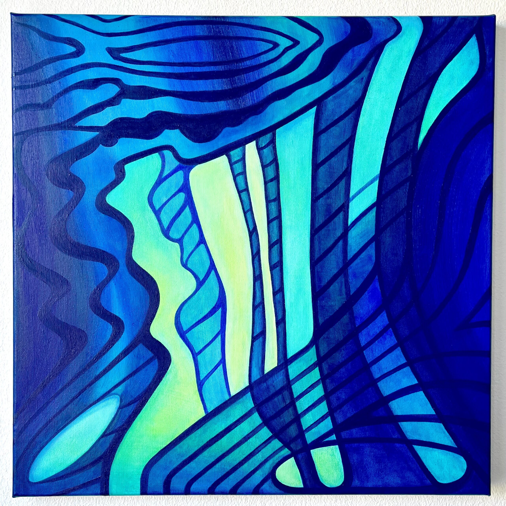
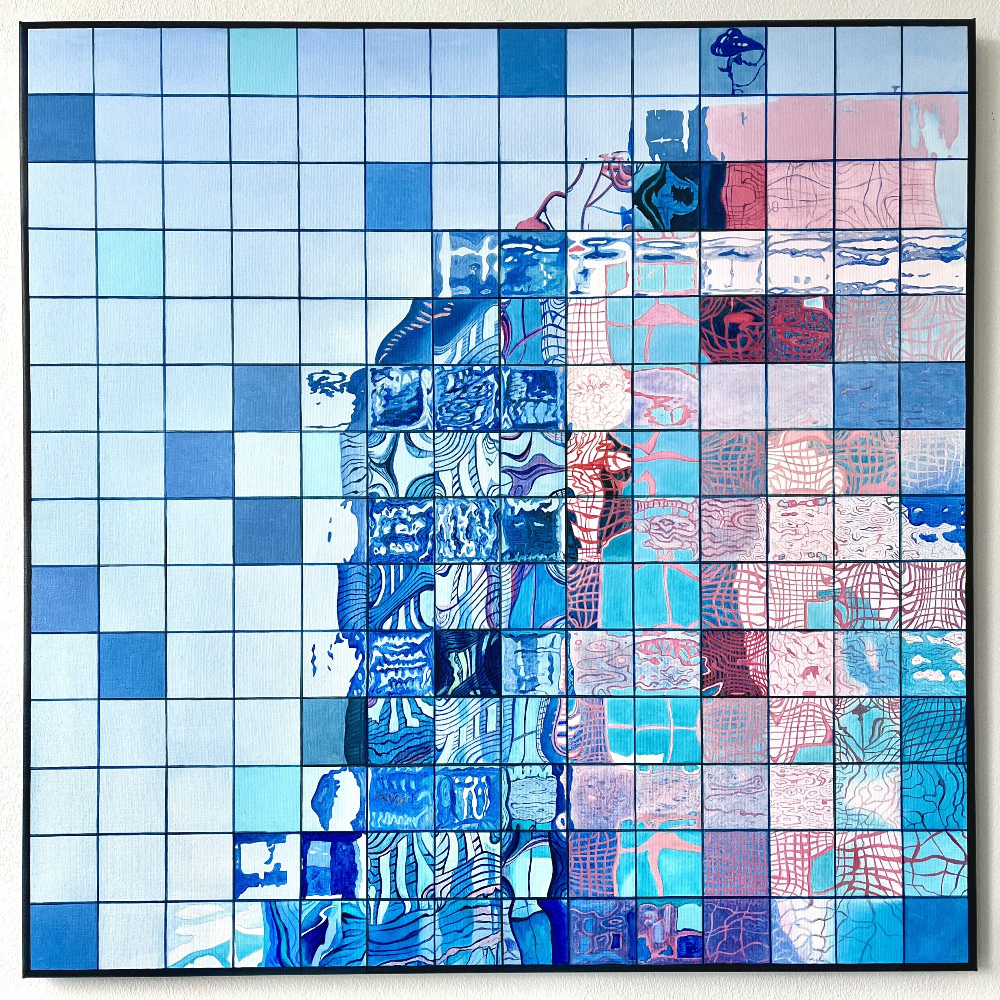

Welcome to the group exhibition “Close Encounter with a Syzygy” at [Art Gallery O-68](https://www.gallery-o-68.com/exposities/close-encounter-with-a-syzygy/), where my oil paintings will be presented alongside with art works of visual artist and my former teacher Rinke Nijburg and his other former students.

<!-- gallery -->

*“Pixel 7.5”, oil on canvas, 50 x 50 cm. “Pixels”, oil on canvas, 100 x 100 cm.*
<!-- /gallery -->

The opening is Sunday 7 September 15.00 – 17.00. 15.30 Artist’s Talk van Rinke Nijburg “The Coockoo’s Chick”  
The finissage is Sunday 5 October 15.00 – 17.00.

During the exhibition the gallery will be open Thursday – Sunday 15.00 – 17.00 and by appointment.  
Contact: Anne Mie Emons [info@gallery-O-68.com](mailto:info@gallery-O-68.com)  
Oranjestraat 74, 6881 SG Velp (bij Arnhem)
