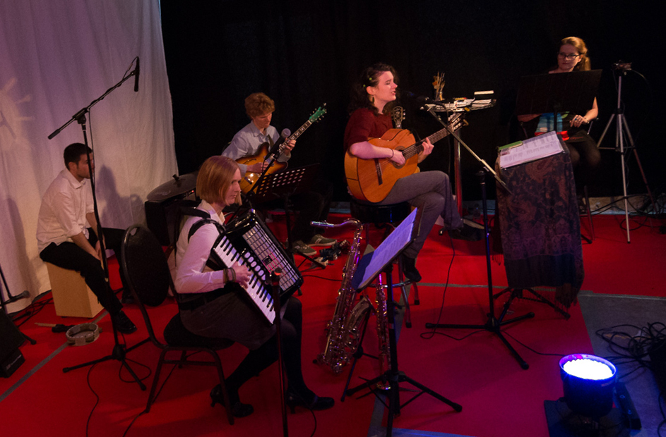
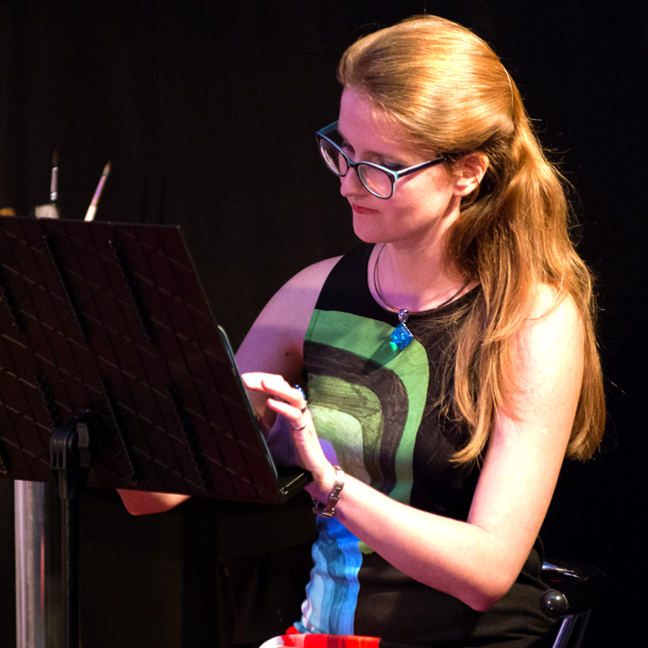
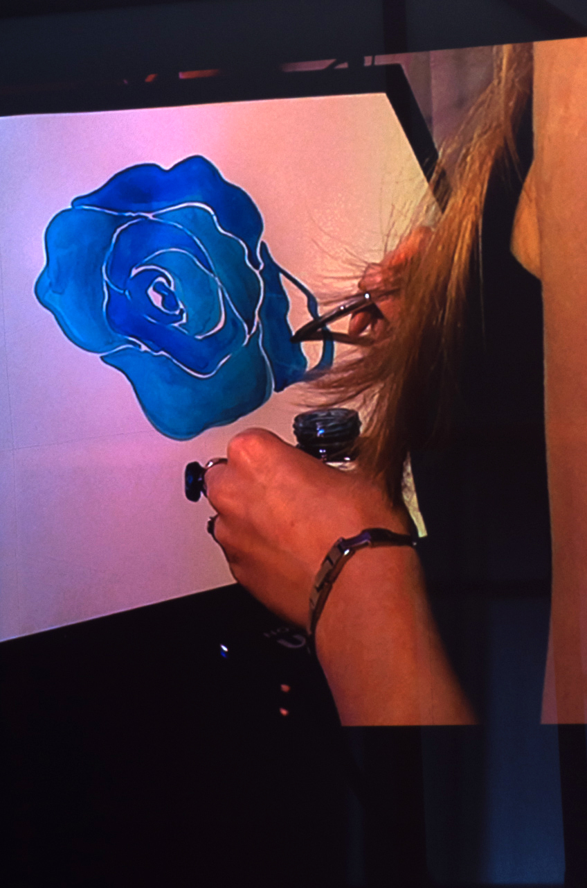

In April 2015 [Colourful Identities](http://www.facebook.com/suzyandalexandra) were performed three times in Berlin and was followed by exhibitions of my paintings. In the performance [Colourful Identities](http://www.facebook.com/suzyandalexandra) both art forms meet: the music of songwriter and composer [Suzy Bartelt](http://www.suzybartelt.de/) and my live visuals (analog and digital animated drawings).

Music is colour, colour is music: loud red, tender blue, hissing orange, sparkling melodies, round or sharp sounds. The energy of colour affects us more intensely than we consciously realise. In music “rhythms and sounds touch our souls at the deepest and shake it most powerfully” (Plato). Is it possible to use different colours and shapes, to let different facets and identities of an ego stand side by side? When am I “myself”? Is it okay to show many different “I’s“? What is the effect on outsiders when I show different “I’s” in my social interaction?

First time we performed in “Loophole” (Berlin Neukölln) and the performance was accompanied only by digital animated drawings.

For the second performance in “Hannes Café” (Berlin Gatow) I made only real drawings: one drawing for each song.

The final performance was at Oranienwerk (Oranienburg, near Berlin) and I create both analog and digital visuals as for [Sonnige Silberne Freiheit](https://youtu.be/fKYvsrUfDIY) .  

<iframe loading="lazy" src="https://www.youtube.com/embed/fKYvsrUfDIY" width="560" height="315" frameborder="0" allowfullscreen="allowfullscreen"></iframe>

Here is a [Colourful Identities trailer](https://youtu.be/GRiK6rZfxFY) where you can see three songs of ten in total.

<iframe loading="lazy" src="https://www.youtube.com/embed/GRiK6rZfxFY" width="560" height="315" frameborder="0" allowfullscreen="allowfullscreen"></iframe>

<!-- gallery -->

<!-- /gallery -->

[Colourful Identities](http://www.facebook.com/suzyandalexandra) band:

vocals/composition/guitar: Suzy Bartelt (DE) – www.suzybartelt.de

live visuals: Alexandra Arshanskaya (RU/NL) – www.arshanskaya.com  
guitar: Matt Baldwin (DE/UK), saxophone/accordion: Mareike Schinzel(DE), percussion: Tom Dayan (DE/IL)

To be continued…
