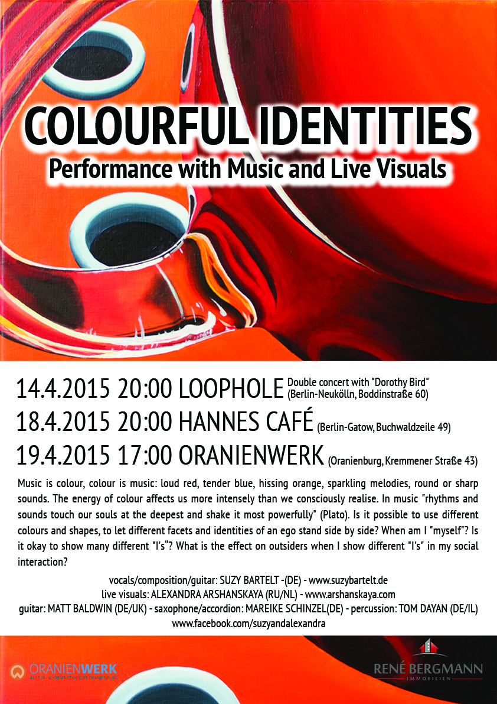

COLOURFUL IDENTITIES  
Performance with Music and Live Visuals

14.4.2015 20:00 LOOPHOLE (Berlin-Neukölln,Boddinstraße 60) Double concert with “Dorothy Bird”  
18.4.2015 20:00 HANNES CAFÉ (Berlin-Gatow, Buchwaldzeile 49)  
19.4.2015 17:00 ORANIENWERK (Oranienburg, Kremmener Straße 43)

Music is colour, colour is music: loud red, tender blue, hissing orange, sparkling melodies, round or sharp sounds. The energy of colour affects us more intensely than we consciously realise. In music “rhythms and sounds touch our souls at the deepest and shake it most powerfully” (Plato). Is it possible to use different colours and shapes, to let different facets and identities of an ego stand side by side? When am I “myself”? Is it okay to show many different “I’s“? What is the effect on outsiders when I show different “I’s” in my social interaction?

In the performance COLOURFUL IDENTITIES both art forms meet: the music of songwriter and composer Suzy Bartelt (Berlin) and live visuals as well as paintings performed by the russian-born artist Alexandra Arshanskaya (The Hague).  
Performances will be accompanied with short term exhibitions of Alexandra’s paintings.

vocals/composition/guitar: SUZY BARTELT -(DE) – www.suzybartelt.de  
live visuals: ALEXANDRA ARSHANSKAYA (RU/NL) – www.arshanskaya.com  
guitar: MATT BALDWIN (DE/UK) – saxophone/accordion: MAREIKE SCHINZEL(DE) – percussion: TOM DAYAN (DE/IL)
