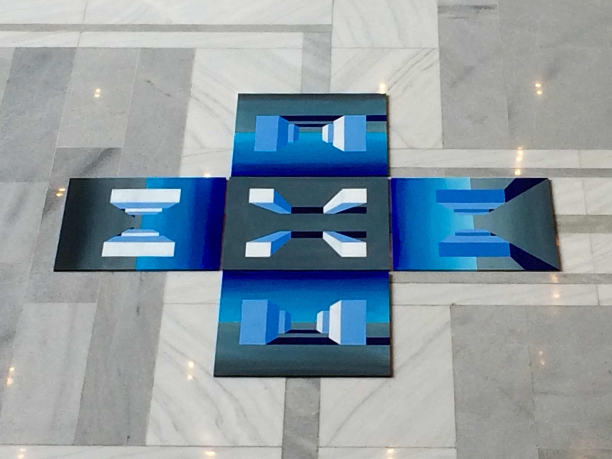
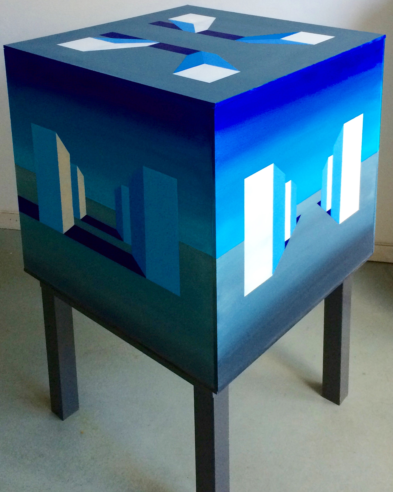

‘Cubus: Five projections of an ideal space’ is a painting installation of 5 acrylic painted mdf-boards (60x60cm each) that represent imaginary landscape of four towers, which are observed from five different viewpoints. The artwork was presented as flat installation at [Art Arnhem Alumni 2015 exhibition](http://www.artarnhem.com/deelnemers-alumni-2015) in October 2015 and as a 3D cube at the [LISFE](http://www.lisfe.nl/lisfe-2016/program-2/) film festival in Leiden (Haagweg, 4) in April 29-30 2016.

