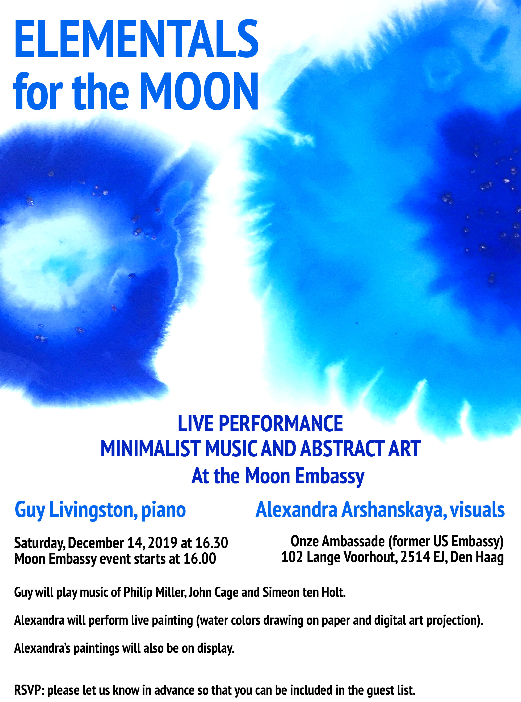

Welcome to the live performance **Elementals: Visual Art & Music for the Moon**

as a part of the **Moon Embassy** event

On Saturday, **December the 14th at 16:30**

Performers:

[**Guy Livingston**](http://guylivingston.com/), piano

[**Alexandra Arshanskaya**](https://arshanskaya.com/), visuals

Location: [**Onze Ambassade**](http://www.onzeambassade.nl/) (Former US Embassy)  
102 Lange Voorhout, 2514 EJ, **The Hague**

studio 367 Performance  
studio 364 Exhibition

Guy will play music of Philip Miller, John Cage and Simeon ten Holt.

Alexandra will perform live painting (water colors drawing on paper and digital art projection).

Alexandra’s paintings will also be on display.

RSVP: please confirm your attendance via contact form or at the [**ELEMENTALS for the MOON event in Facebook**](https://www.facebook.com/events/1454007791429825/) so that you can be included in the guest list.

Guests will be welcomed at 16.00 at the reception.

[**Moon Embassy event**](https://www.facebook.com/events/725436387947360) program:

16:00 – guests arrival, solar & terrestrial viewing;

16:30 – live sound & visual performance ELEMENTALS by Guy Livingston & Alexandra Arshanskaya;

17:00 – ArtMoonMars MoonGallery talks & workshop;

18:00 – Moon Gallery exhibition, drinks & telescopes;

20:00 – Telecon with EMMIHS crew & official Moon Gallery demonstrator opening at the Moon analog & simulation base HI-SEAS, Hawaii.
