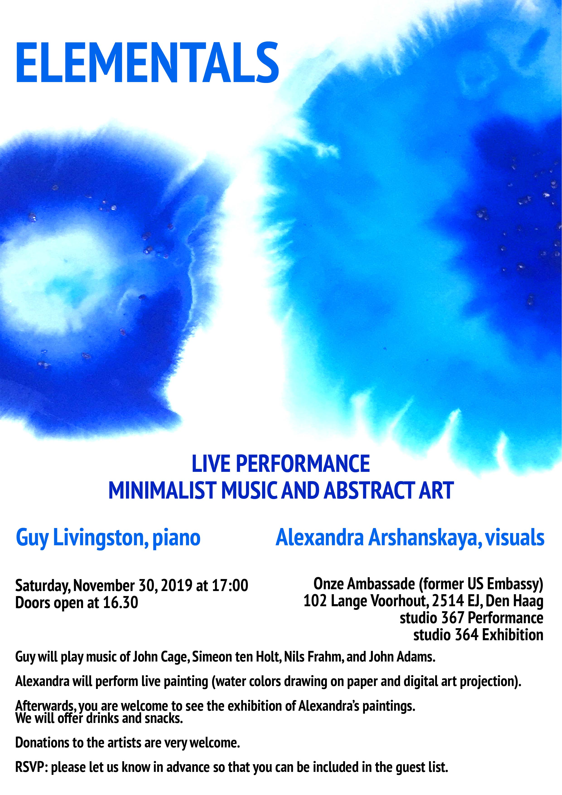

Welcome to the live performance **Elementals: Minimalists Music and Abstract Art**](../../assets/uploads/2019/11/Elementals-poster.jpg)

On Saturday, **November the 30th at 17:00**

Performers:

[**Guy Livingston**](http://guylivingston.com/), piano

[**Alexandra Arshanskaya**](https://arshanskaya.com/), visuals

Location: **Onze Ambassade** (Former US Embassy)  
102 Lange Voorhout, 2514 EJ, **The Hague**

studio 367 Performance

studio 364 Exhibition

Doors open at 16.30

Guy will play music of John Cage, Simeon ten Holt, Nils Frahm, and John Adams.  
Alexandra will perform live painting: water colors drawing on paper and digital art projection.

Afterwards, you are welcome to see the exhibition of Alexandra’s paintings.

We will offer drinks and snacks.  
Donations to the artists are very welcome.

**RSVP**: please let us know in advance so that you can be included in the guest list.
