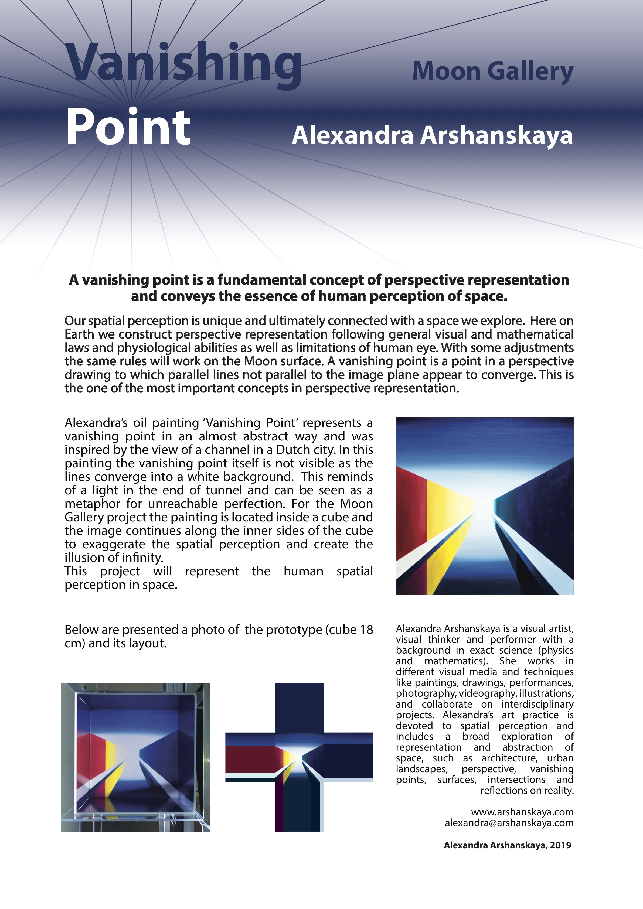

In September 15 – 20 I’m attending [European Planetary Science Congress](https://www.epsc-dps2019.eu/) in Geneva.

Within [Planetary exploration through Arts](https://meetingorganizer.copernicus.org/EPSC-DPS2019/session/34134) session:

– on Thursday September 19th I present my poster about my project “Vanishing Point” for the [Moon Gallery](http://www.moongallery.info/)

– on Friday September 20th I give a talk about my artistic research “Spatial Perception”.

Welcome!
