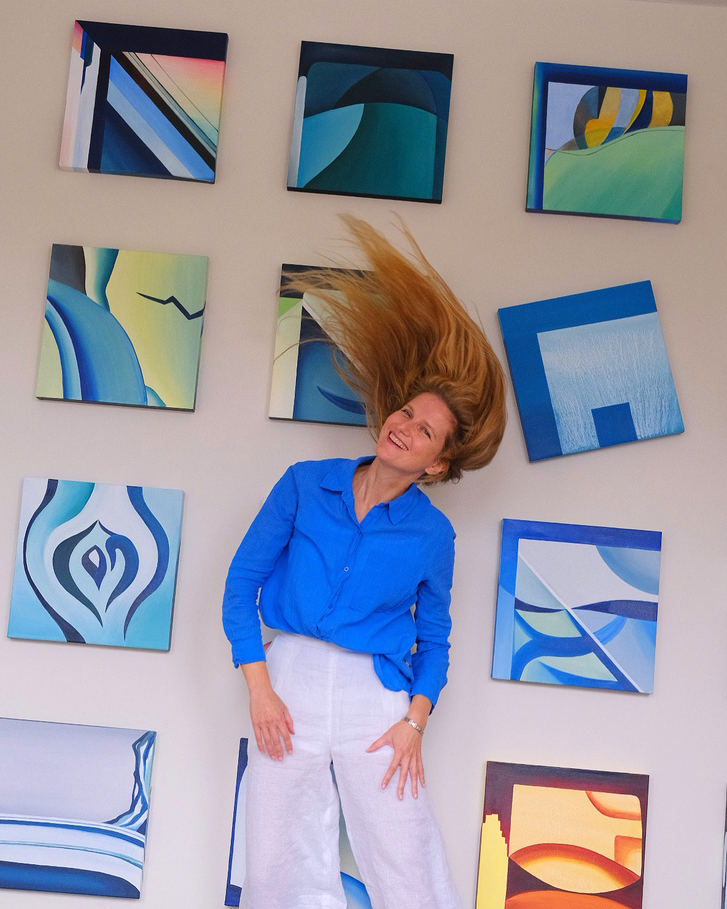

Last three days to visit my exhibition at Onze Ambassade (Former American Embassy), where all my paintings, including very new ones, are exposed.

Also available during Hoogtij on Friday September 25th.

By appointment only.

Lange Voorhout 102, 2514 EJ The Hague

Reserve your visit before Sunday September 27 via [contact form](https://arshanskaya.com/contact-form/).

