The exhibition of my 28 oil paintings are now on display at [Art Gallery O-68](http://www.gallery-o-68.com/ "http://www.gallery-o-68.com/") in Velp.  
The gallery is open Tuesday-Friday 2-5 pm and by appointment.  
Oranjestraat 68  
6881 SG Velp, GLD, Nederland  
T: 026 3639222, M: 06 12594329

<!-- gallery -->
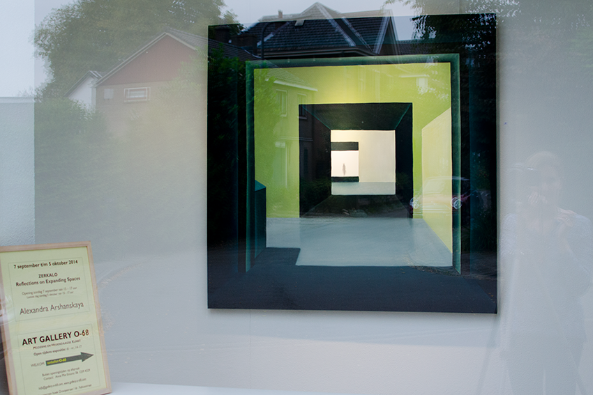

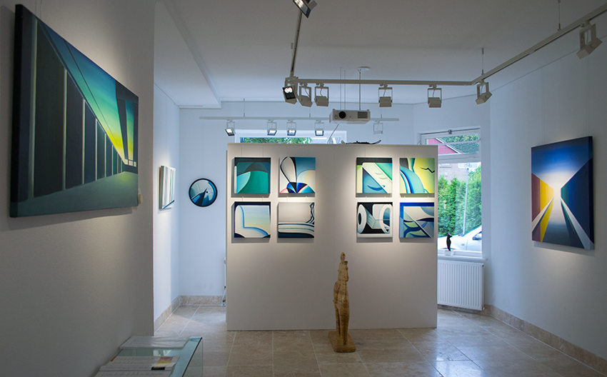

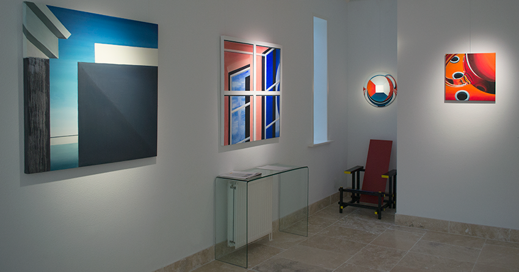

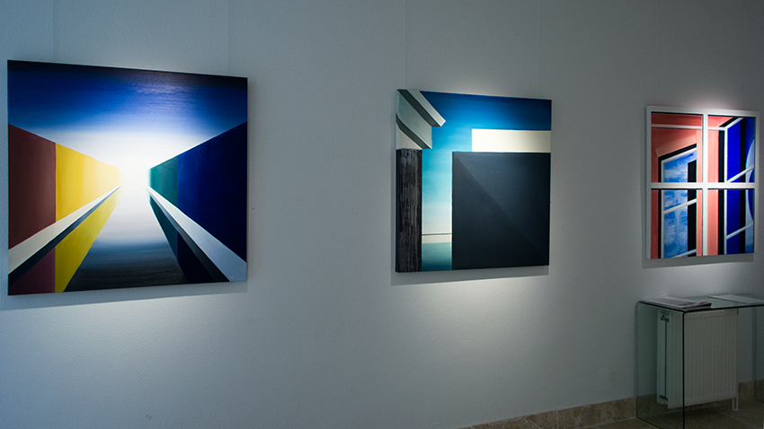

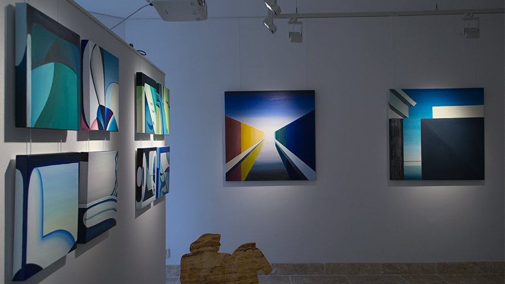

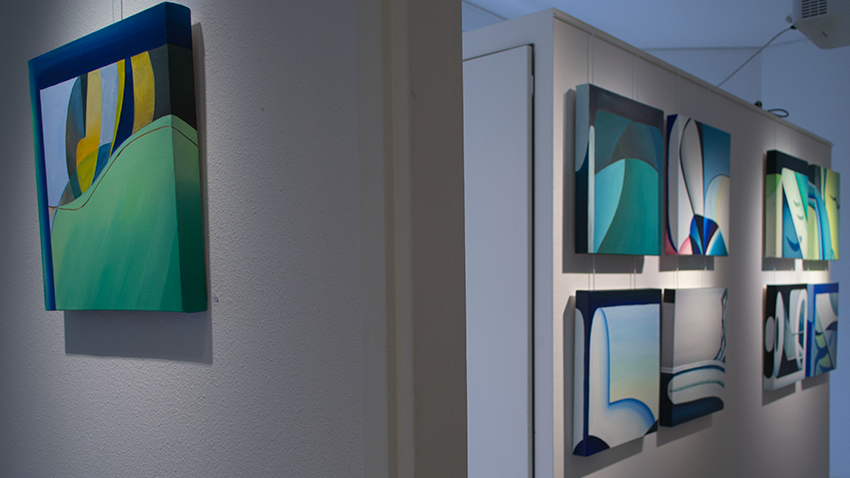

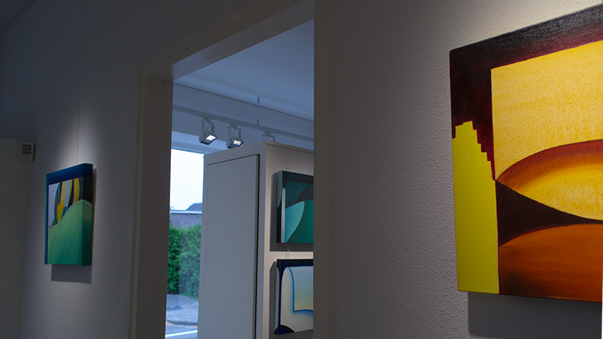

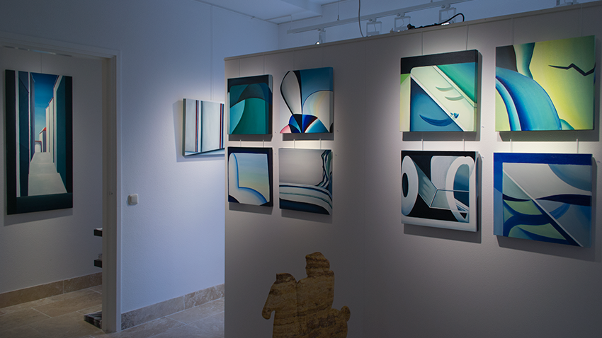

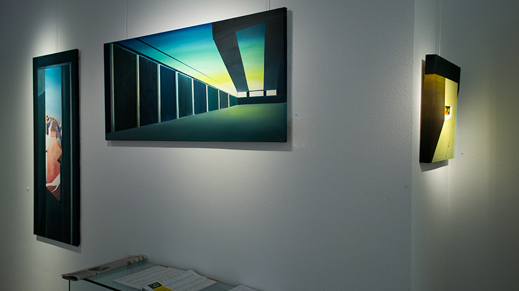

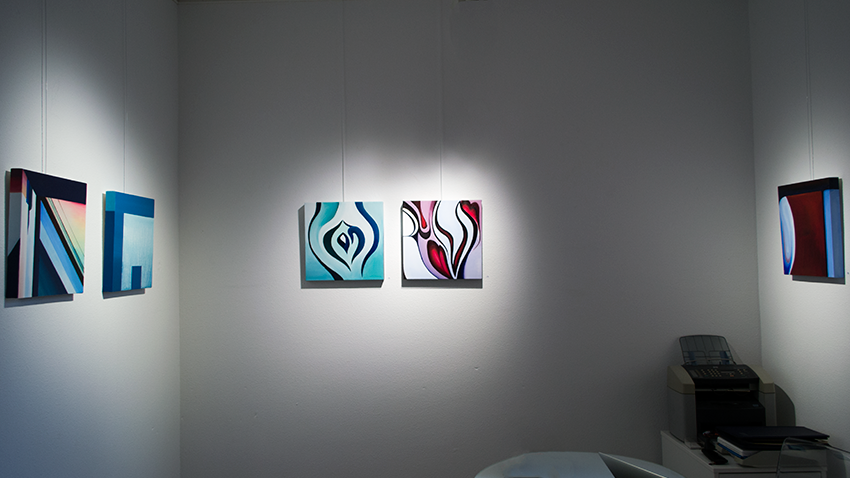

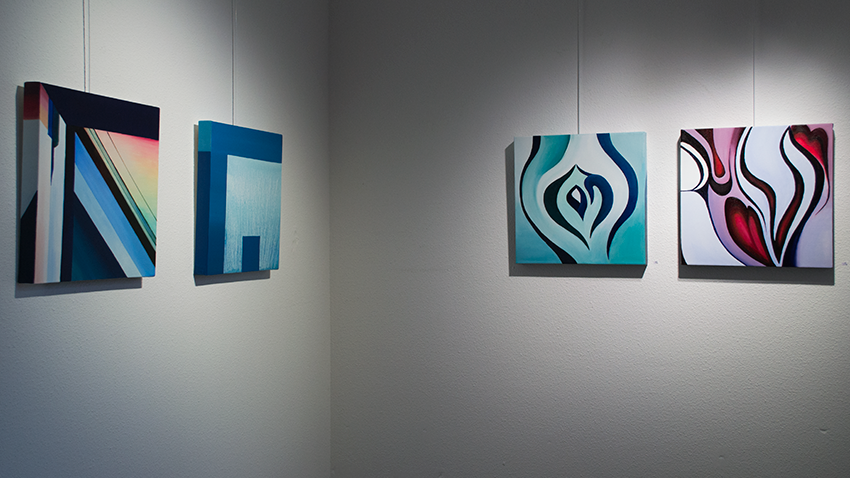

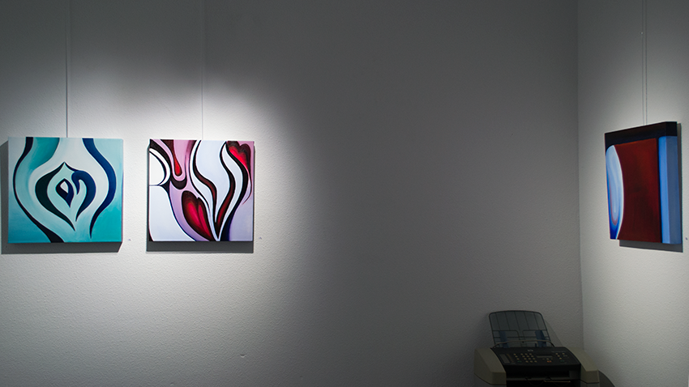
<!-- /gallery -->

After a big success of the opening performance, I will perform again Live Drawing with Live Electroacoustic Music by musician Sharon Stewart during the finissage of the exhibition on 5 October.  
From 6th till 24th of October the Gallery will be open only by appointment.

[The opening of ‘ZERKALO’ on Facebook](https://www.facebook.com/events/604180879701100/ "https://www.facebook.com/events/604180879701100/")

[About ZERKALO in Museumtijdschrift (in Dutch)](http://museumtijdschrift.nl/tentoonstellingsagenda/zerkalo-reflection-on-expanding-spaces/ "http://museumtijdschrift.nl/tentoonstellingsagenda/zerkalo-reflection-on-expanding-spaces/")

The article in [Kunstkrant](http://www.gallery-o-68.com/wp-content/uploads/2014/08/5-kunstkrant-septokt-2014-web.pdf "http://www.gallery-o-68.com/wp-content/uploads/2014/08/5-kunstkrant-septokt-2014-web.pdf") (Art Newspaper) about my upcoming exhibition at Art Gallery O-68 .  
Browse the latest issue N.5 (sept-oct 2014), see page 3 to read the article.  
[The article in Kunstkrant About ZERKALO (in PDF)](http://www.gallery-o-68.com/wp-content/uploads/2014/08/5-kunstkrant-septokt-2014-web.pdf "http://www.gallery-o-68.com/wp-content/uploads/2014/08/5-kunstkrant-septokt-2014-web.pdf")
