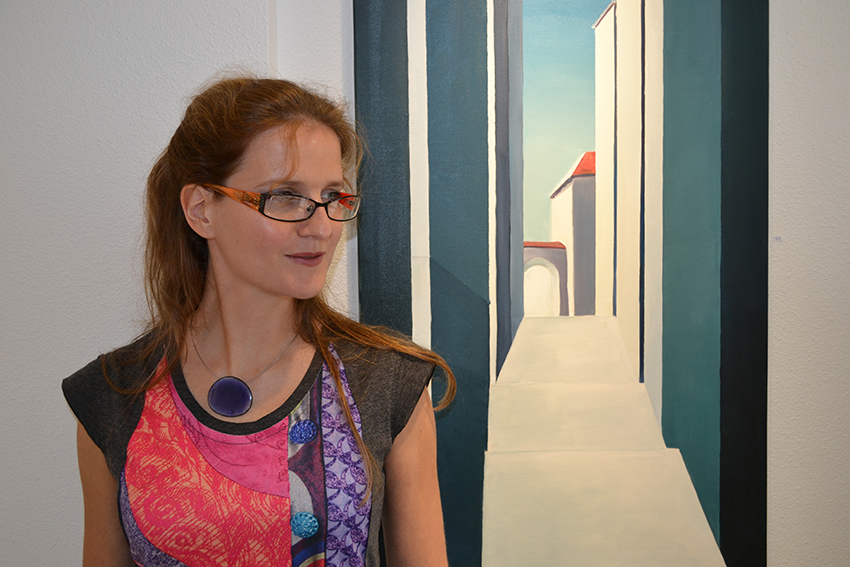
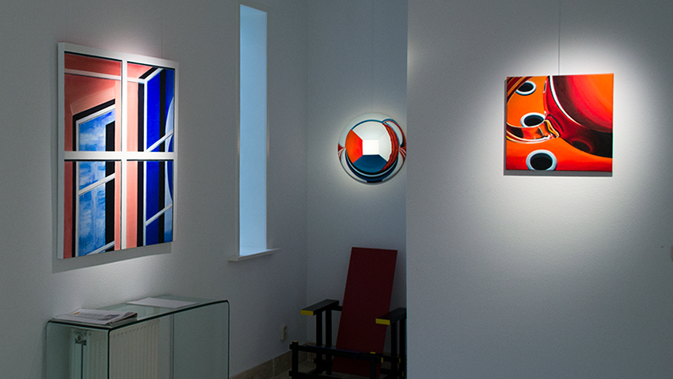
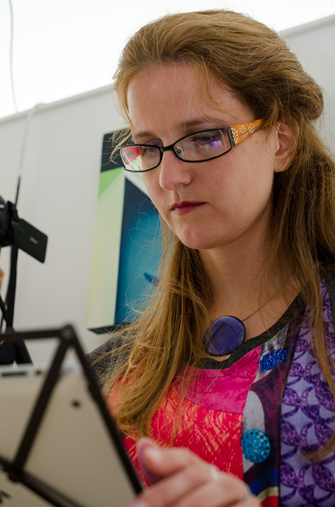
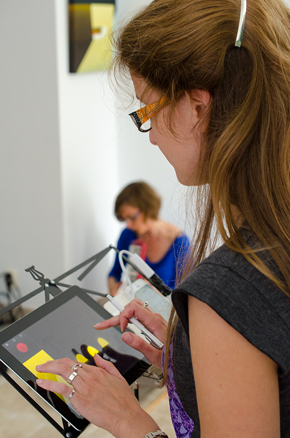

On Sunday 5th of October 3pm-5pm will be the finissage of my exhibition ‘ZERKALO: Reflection on expanding spaces’ at [Art Gallery O-68](http://www.gallery-o-68.com/ "http://www.gallery-o-68.com/"), where 28 paintings of mine are currently on display. After the successful opening I’m going to perform again Live Drawing with Live Electroacoustic Music by musician Sharon Stewart at 3.30.  
[The finissage of ‘ZERKALO’ on Facebook](https://www.facebook.com/events/709147002488595/ "https://www.facebook.com/events/709147002488595/")  
My paintings will be exposed till 24th of October, but after the finissage the gallery will be open only by appointment.

<!-- gallery -->

<!-- /gallery -->

Art Gallery O-68  
Oranjestraat, 68  
6881 SG Velp, GLD, Nederland  
T: 026 3639222, M: 06 12594329
