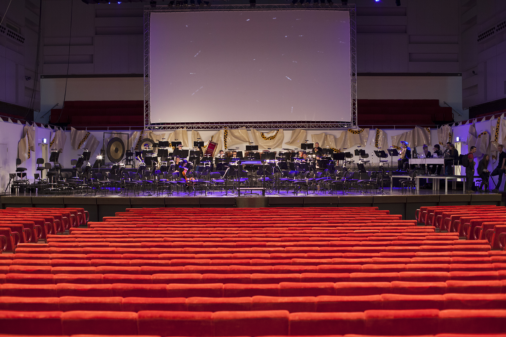

On 4th, 5th, 11th, 12th and 13th of October I’m making live drawing during the performance of ‘Le Sacre du Printemps’ with Residentie Orkest in Dr Anton Philipszaal (The Hague), where an interdisciplinary and international team from the Royal Academy of Art (KABK) presents live video art.  
Welcome!

Information and tickets:  
http://www.ldt.nl/programma/2101/Residentie\_Orkest/RO\_NDT\_25\_jaar\_Spuiplein/

Link to Royal Academy of Art:  
[Live video performance ‘Le Sacre du Printemps’](http://www.kabk.nl/newsitemEN.php?newsid=0412&cat=09/ "http://www.kabk.nl/newsitemEN.php?newsid=0412&cat=09/")

