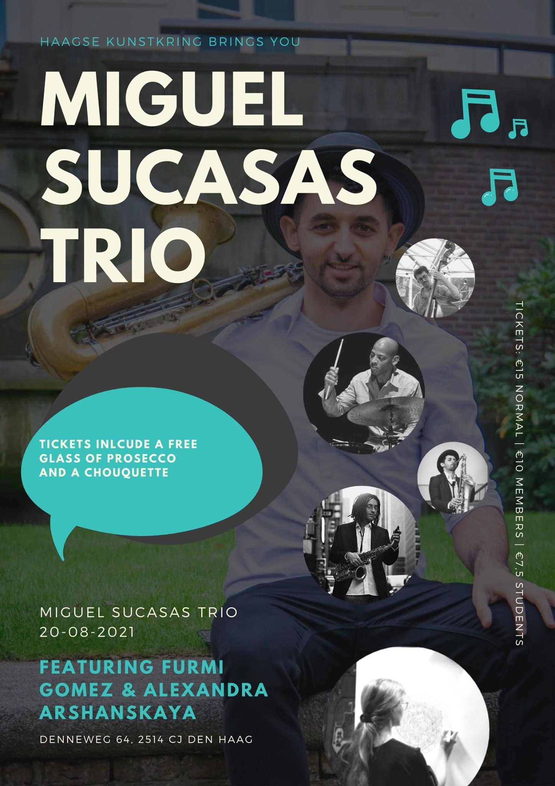

Coming Friday I will perform live painting during jazz concert of Miguel Sucasas Trio.  
Come to enjoy live music and live painting!

August 20 at 21.00 – 23.00 at Haagse Kunstkring (Denneweg, 64, The Hague)  
Doors open at 20.30.

More about the concert: [Jazzconcert Miguel Sucasas Trio](https://www.haagsekunstkring.nl/index.php/activiteiten/concerten/1246-jazzconcert-miguel-sucasas-20-8-2021)  
[Tickets to the concert](https://www.ticketkantoor.nl/shop/jazz20aug/en)  
Tickets include a free glass of Prosecco and Chouquette!

**Miguel Sucasas (saxophone), Yussif Barakat (double bass) and Owen Hart jr. (drums) play their own compositions and some classical jazz standards.  
Special guests: Furmi Gomez (saxophone).  
Visual artist Alexandra Arshanskaya performs live painting during the concert.**

