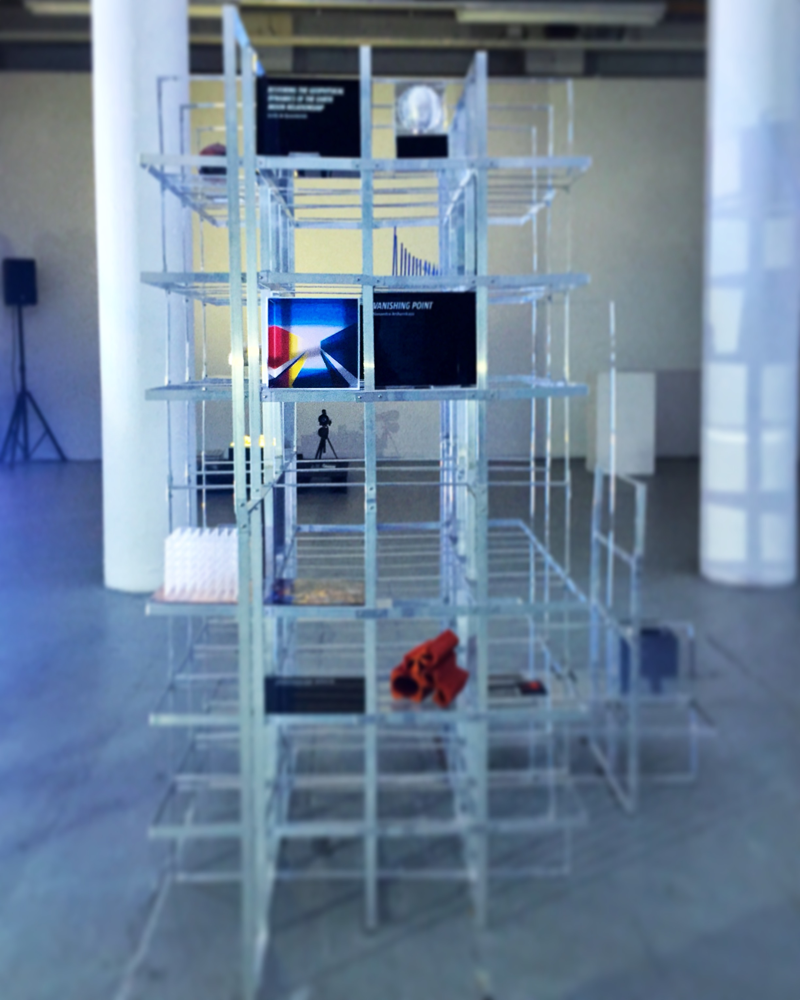

Cube the ‘Vanishing Point’, my prototype for the Moon Gallery project  (to send art to the Moon in 2022 with support of the European Space Agency ) is exposed at the Quartair Contemporary Art Initiative during the [Hoogtij Den Haag](http://www.hoogtij.net/en/galerie/quairtair/).

Join the [Moon Gallery](http://www.moongallery.info/) show at the [Quartair](https://www.quartair.nl/1-engels/index-eng.htm) (Toussaintkade 55, The Hague) on Friday May 24th (19 till23) and Saturday May 25th (from 12 till 22).

Welcome!
