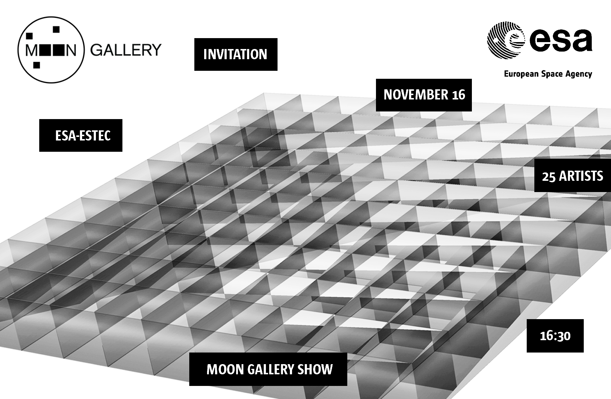

Welcome to the Inaugural Moon Gallery show at ESTEC where my proposal will be exhibited among other submitted to the first Moon Gallery Submission Open Call.

The First Moon Gallery **\*invite only** show opens **November 16** at **16:30** at The **European Space Research and Technology Centre** (**ESTEC**), the European Space Agency’s main technology development and test centre for spacecraft and space technology.

Please, let me know if you want to join.  
For security reason guests have to provide the following information:  
first hame, last name, affiliation  
by **November 13** to request the badges.  
Also please remember to bring ID or Passport for Security gate.

More information is [here](https://us19.campaign-archive.com/?e=[UNIQID]&u=6c23415cf13153d698fec818e&id=97fd82e8e3).

