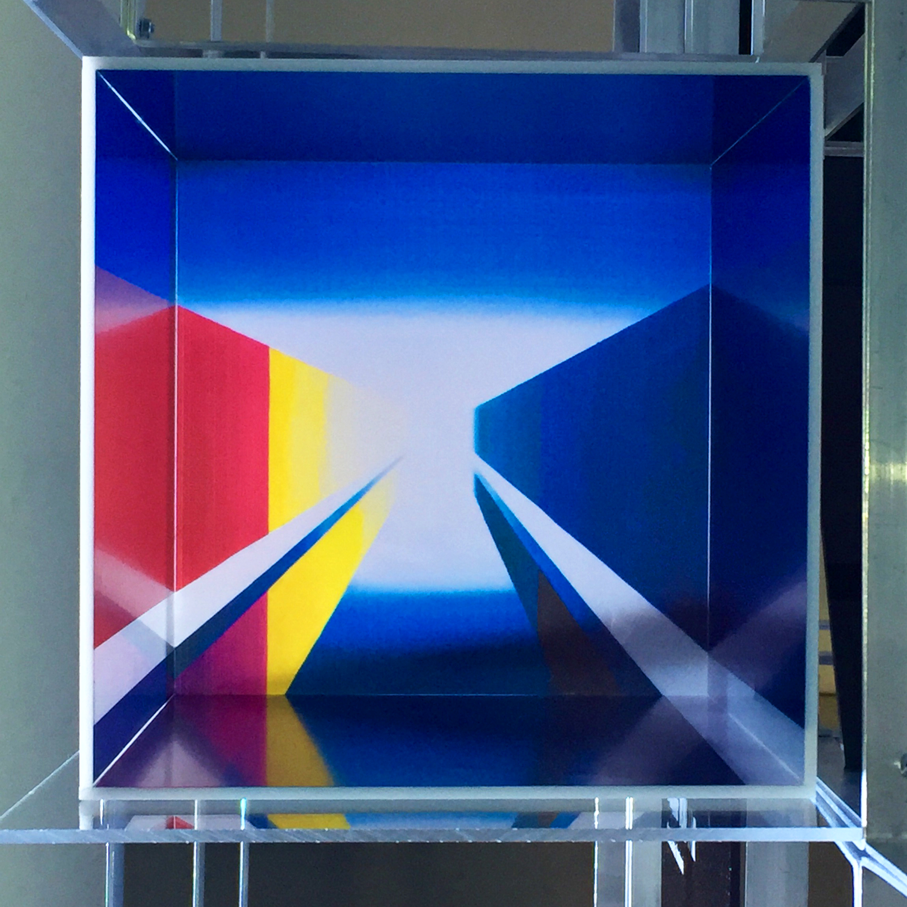

Today June 18th at 18.30 I will participate remotely at Mini Space Conference & Moon Gallery workshop at Gallery AIR (Art.ITMO.Residency) as a part of Global Space Exploration Conference (GLEX) in St. Petersburg. I will give a talk about my Moon Gallery submission (first art gallery on the Moon) in the context of my artistic practice. Join this event to know more about the Moon Gallery and my project “Vanishing Point”. I’ll give a talk in English, but this is possible to ask questions in Russian. Here is a link for free registration in this event: [https://art-and-science-center.timepad.ru/event/1679068/…](https://art-and-science-center.timepad.ru/event/1679068/?fbclid=IwAR0ZRUM1r8ipDwy1h-W5-T_DZzhJEM-VznSdHucwIrdgtr9y4oX1tPJdxt8)

