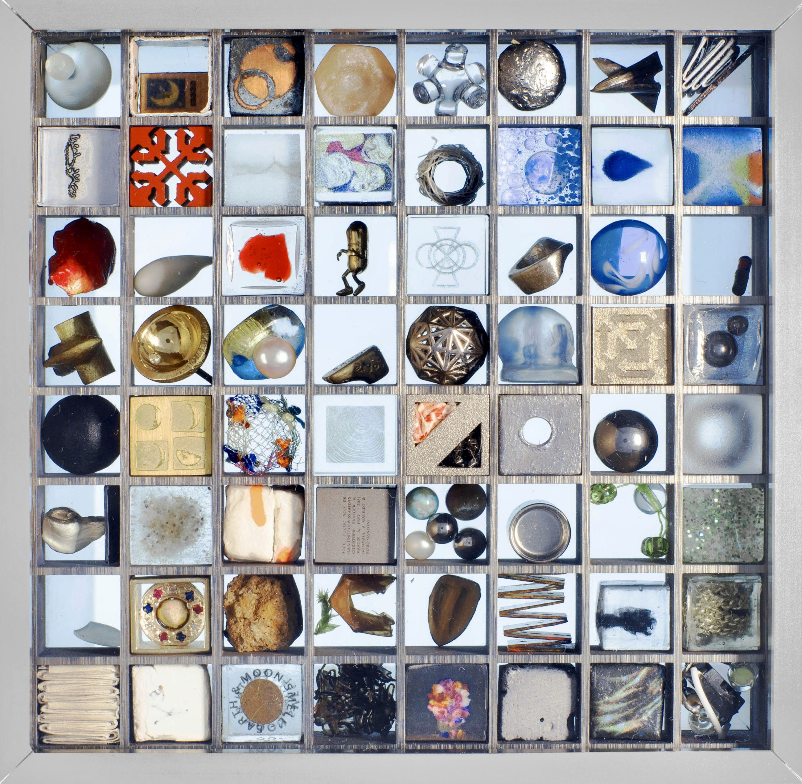
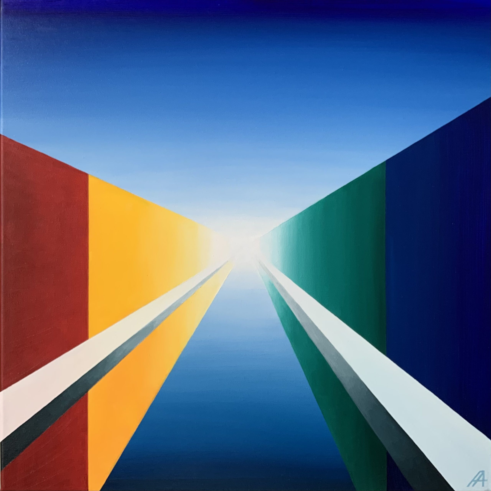

MOON GALLERY TEST FLIGHT TO LAUNCH TO ISS, 19 FEBRUARY 2022

My artwork “Vanishing Point” as a part of the Moon Gallery flies to the International Space Station aboard the NG-17 rocket on 19 February of 2022, from Wallops Island Virginia. This edition of the Moon gallery 8×8 grid features 1 cm3 cells housing 64 physical artifacts and one engraved AR artwork. The art projects featured in the gallery will reach the final frontier of human habitat and mark the historical meeting point of the Moon Gallery and the cosmos.

The launch is scheduled for 12:39 EST, 17:39 UTC.  
Check the [official NASA website](https://www.nasa.gov/press-release/nasa-sets-coverage-opens-virtual-experience-for-next-cargo-launch) for live streaming of the launch.

The Moon Gallery installation will remain at the ISS till the end of the 2022.

<!-- gallery -->

*Moon Gallery to ISS*
<!-- /gallery -->

**My project [“Vanishing point”](https://arshanskaya.com/vanishing-point-project-for-moon-gallery/) is about the fundamental concept of perspective representation. As a part of the Moon Gallery the “Vanishing Point” represents in Space the essence of human spatial perception: at the ISS, reaching low Earth orbit, and eventually at the Moon surface.**
