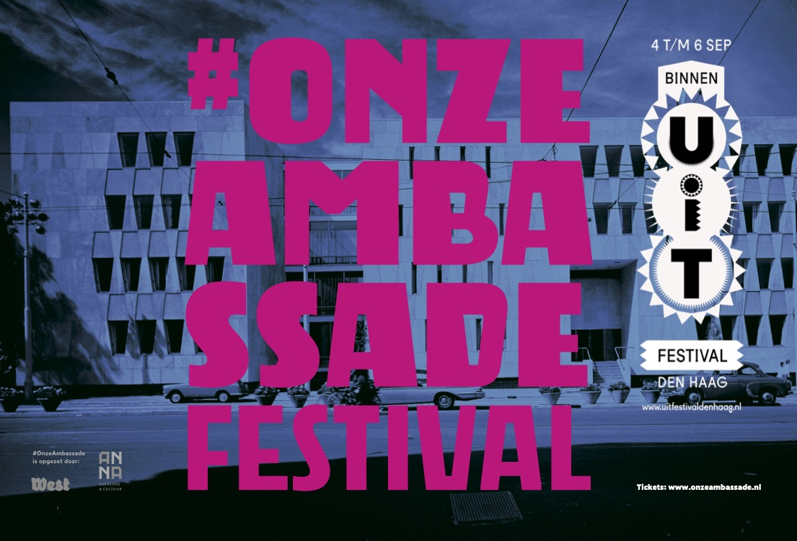
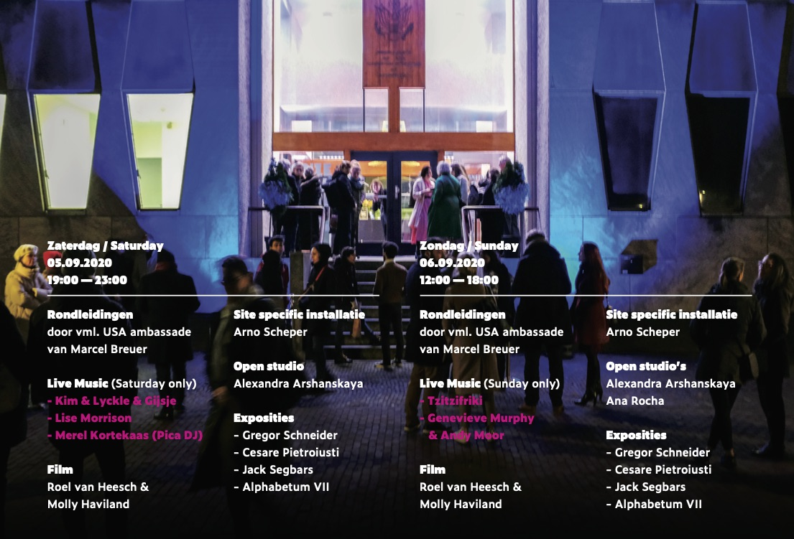

Welcome to my open studio and exhibition at Onze Ambassade (Former American Embassy), where all my paintings, including very new ones, will be exposed during [Onze Ambassade Festival](https://www.uitfestivaldenhaag.nl/programme_page/onze-ambassade-2/) as part of UIT Festival in The Hague coming weekend.

Saturday September 5th 19.00 – 23.00  
Sunday September 6th 12.00 – 18.00  
Lange Voorhout 102, 2514 EJ Den Haag

Every half an hour there will be a guided tour around the entire building with lots of exhibitions and performances, including my exhibition.  
Please, register and get your ticket vie [Eventbrite](https://www.eventbrite.nl/e/tickets-onze-ambassade-festival-2020-116095257039) (€5).

[Event in Facebook](https://www.facebook.com/events/2040152949617511)

If you can’t make it this weekend, you are welcome to visit my studio and exhibition by appointment.  
The exhibition will run through September.  
In this case, please, register via [contact form](https://arshanskaya.com/contact-form/).

