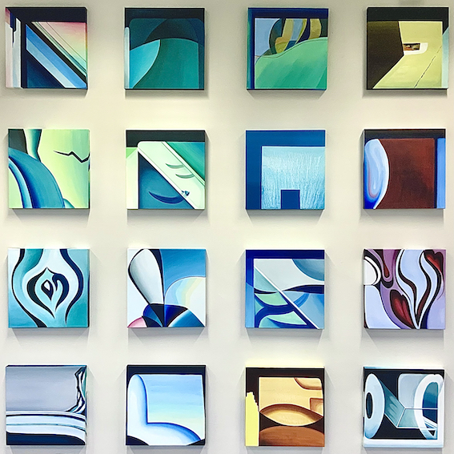

“Intertwined Realities” (16 oil paintings, 40x40x3cm each) are again on view (but in different arrangement) among many other paintings of mine at this year [Onze Ambassade Festival](http://westdenhaag.nl/exhibitions/21_09_OnzeAmbassadeFestival).  
Come this Sunday September 5th 12-18 to at Onze Ambassade (Former US-embassy, 102 Lange Voorhout, 2514 EJ Den Haag) and enjoy many art activities (concerts, exhibitions, performances…) and visit my exhibition and Open Studio as a part of [UIT Festival Den Haag](https://www.uitfestivaldenhaag.nl/evenementen/onze-ambassade-festival-met-alexandra-arshanskaya/).

Tickets are available via [Eventbrite](https://www.eventbrite.nl/e/tickets-onze-ambassade-festival-3-165383734201).  
Event in [Facebook](https://www.facebook.com/events/209629284317606).

