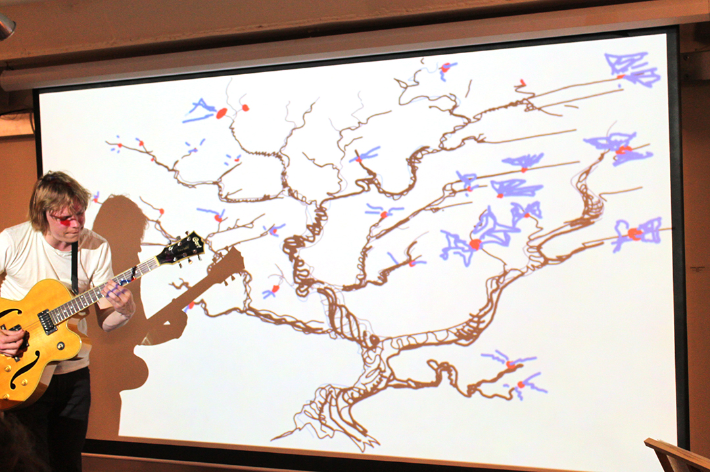

On Friday I will perform Live Drawing with Experimental Guitar Improvisations of Tomas Ciucelis (www.tomasciucelis.com)

Friday 4th of October at 8-10 p.m.  
at Long White Cloud  
151 Hackney Road  
Hoxton  
E2 8JL

Links to event:  
[Haunted Jazz Session with Live Drawing Performance](http://www.longwhitecloudhoxton.com/haunted-jazz-sessions/ "http://www.longwhitecloudhoxton.com/haunted-jazz-sessions/")

[Event in Facebook](https://www.facebook.com/events/527542730664992/ "https://www.facebook.com/events/527542730664992/")

