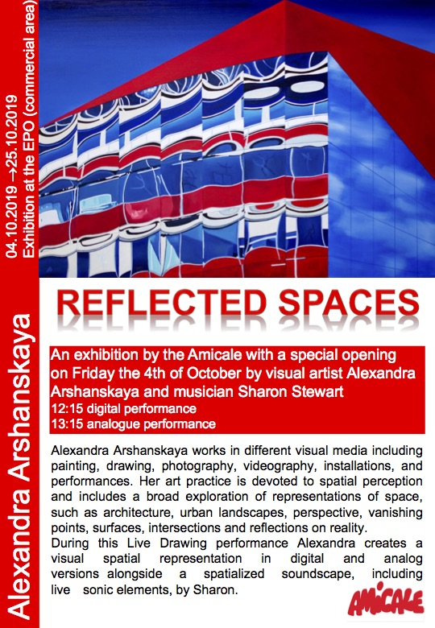

Welcome to my solo exhibition “**Reflected Spaces**” at EPO (European Patent Office)! 

The opening is on Friday October 4th at noon at Patentlaan 2, Rijswijk.

During the opening I will perform twice live drawing with alongside a spatialized soundscape, including live sonic elements, by musician Sharon Stewart ( [www.mixesfromthefield.com](http://www.mixesfromthefield.com/)):

*   12:15 digital performance
*   13:15 analogue performance
