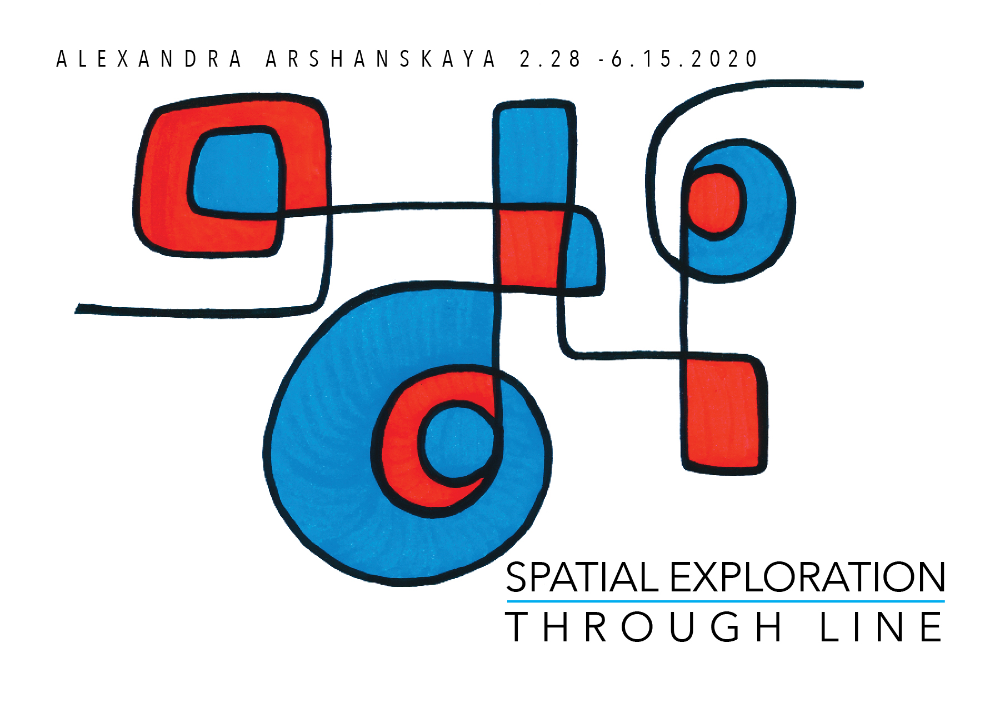
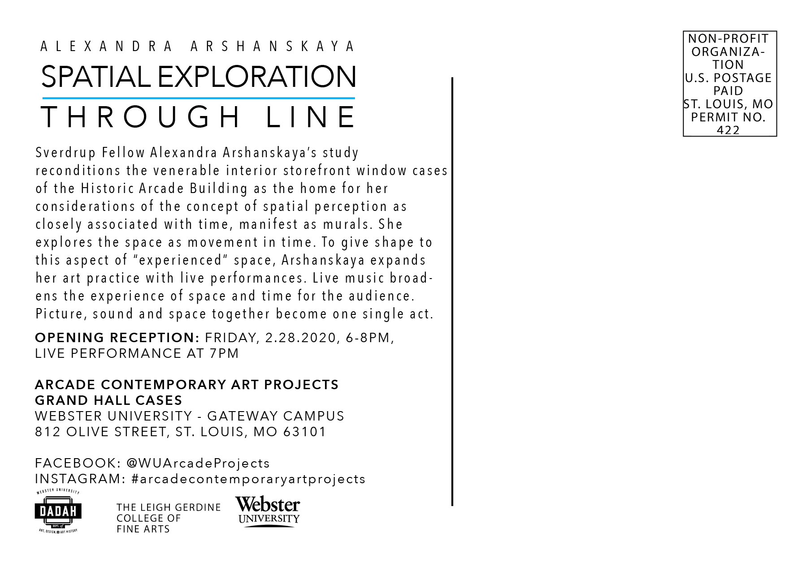

Welcome to the opening of my murals on Friday February 28 at 6 pm at the [Arcade Contemporary Art Projects gallery](https://www.facebook.com/WUArcadeProjects), St. Louis, Missouri, USA. Live digital drawing with live jazz music at 7 pm.

[Event in Facebook](https://www.facebook.com/events/1710749915747701/)

Alexandra Arshanskaya’s study reconditions the venerable interior storefront window cases of the Historic Arcade Building as the home for her considerations of the concept of spatial perception as closely associated with time, manifest as murals. She explores the space as movement in time. To give shape to this aspect of “experienced” space, Alexandra expands her art practice with live performances. Live music broadens the experience of space and time for the audience. Picture, sound and space together become one single act.

[Spatial Exploration Through Line](../../assets/uploads/2020/02/Arshanskaya.-Spatial-Exploration-Exhibition.pdf)

