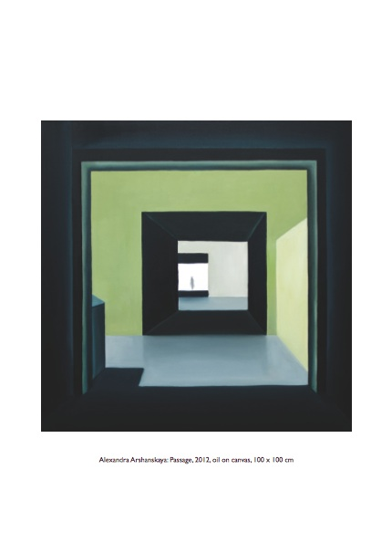
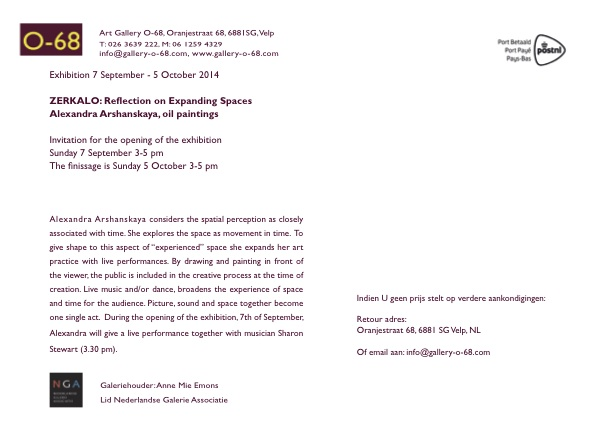
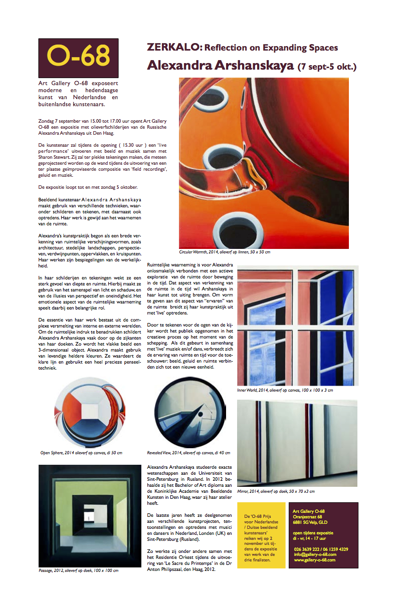

More than 20 oil paintings of mine will be on display at [Art Gallery O-68](http://www.gallery-o-68.com/ "http://www.gallery-o-68.com/") in Velp.  
During the opening of the exhibition, 7 September at 3.30 pm, I will perform Live Drawing with Live Electroacoustic Music by musician Sharon Stewart.

The invitation for the opening of the exhibition and the article about this in Kunstkrant:

<!-- gallery -->

<!-- /gallery -->

The opening is Sunday 7 September 3-5 pm.  
The finissage is Sunday 5 October 3-5 pm.  
During the exhibition the gallery will be open Tuesday-Friday 2-5 pm and by appointment.

Oranjestraat 68  
6881 SG Velp, GLD, Nederland  
T: 026 3639222, M: 06 12594329

[ZERKALO on Facebook](https://www.facebook.com/events/604180879701100/ "https://www.facebook.com/events/604180879701100/")

[About ZERKALO in Museumtijdschrift (in Dutch)](http://museumtijdschrift.nl/tentoonstellingsagenda/zerkalo-reflection-on-expanding-spaces/ "http://museumtijdschrift.nl/tentoonstellingsagenda/zerkalo-reflection-on-expanding-spaces/")

The article in [Kunstkrant](http://www.gallery-o-68.com/wp-content/uploads/2014/08/5-kunstkrant-septokt-2014-web.pdf "http://www.gallery-o-68.com/wp-content/uploads/2014/08/5-kunstkrant-septokt-2014-web.pdf") (Art Newspaper) about my upcoming exhibition at Art Gallery O-68 .  
Browse the latest issue N.5 (sept-oct 2014), see page 3 to read the article.  
[The article in Kunstkrant About ZERKALO (in PDF)](http://www.gallery-o-68.com/wp-content/uploads/2014/08/5-kunstkrant-septokt-2014-web.pdf "http://www.gallery-o-68.com/wp-content/uploads/2014/08/5-kunstkrant-septokt-2014-web.pdf")
